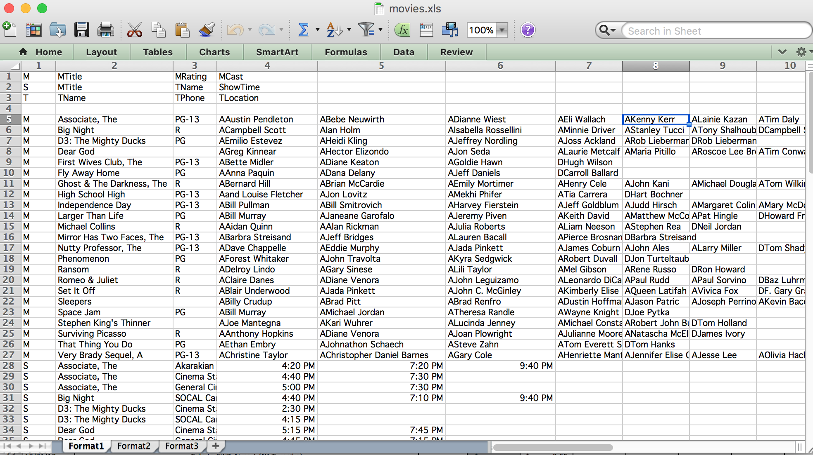
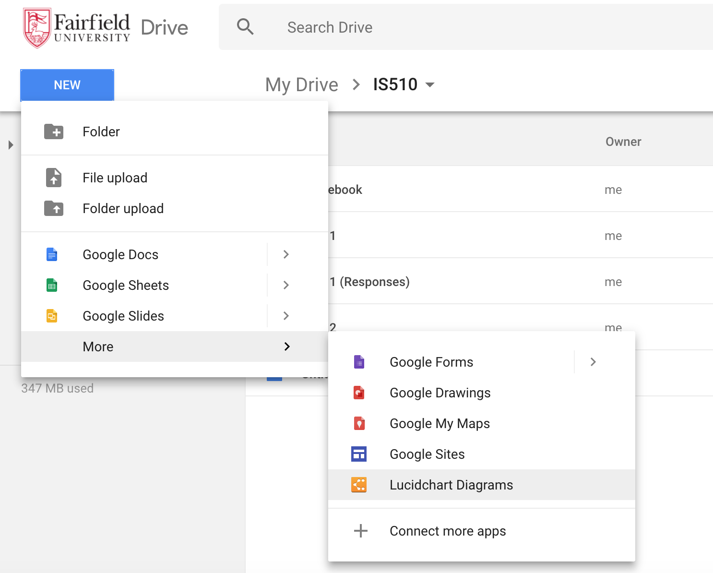
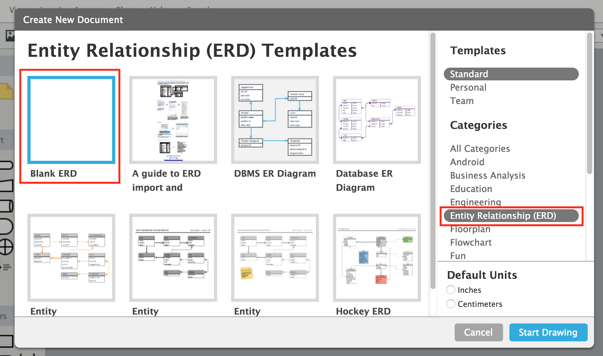
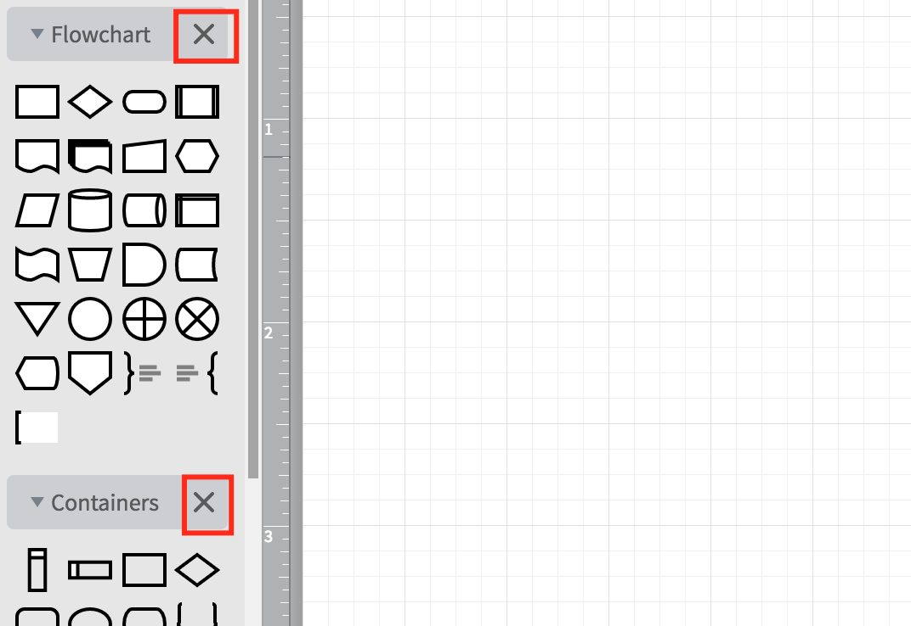
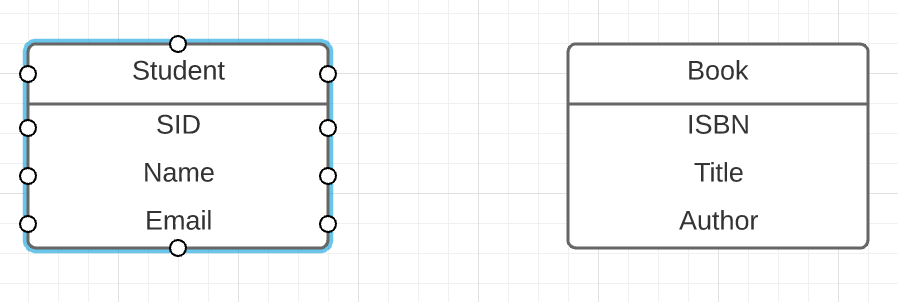
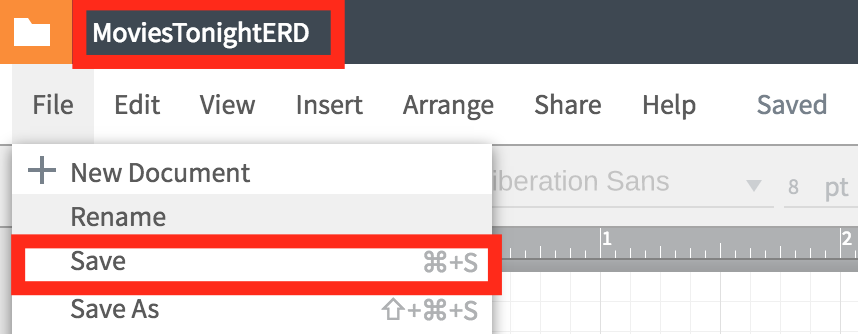
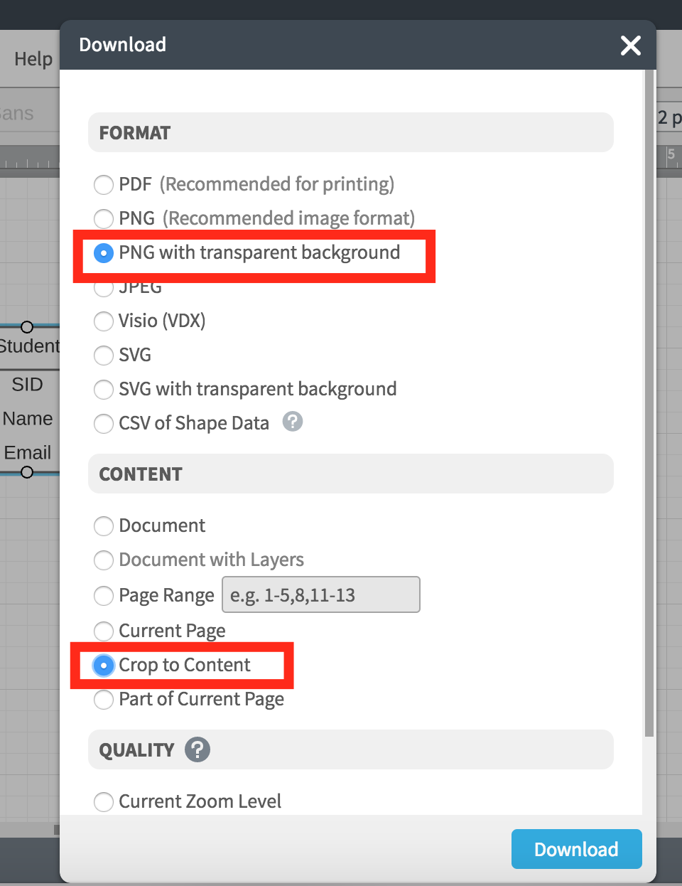

# Movies Tonight

## Overview
This multipart project is designed to provide practice with database design and coding in SQL. Each short assignment applies what you have learned in the classroom that week. __Do not do assignments until they are assigned. They may change at any time until they are formally assigned.__

__You are encouraged to collaborate with your peers.__ However, you are also responsible for learning the key lessons of each assignment. So, if you need help, ask for it and pay attention to the answers. If you know how to help someone (without doing the work for them), then please help them out.

## Part 1: Data Analysis

1. **In Atom, create a new file named `DataModelingNotes.md` in this repository folder.** At the top of the file, use Markdown to add the header "Data Modeling Notes". We will add sections to the document as we go along.
2. **Study the [Movies Tonight](http://christopherhuntley.github.io/movies-tonight) web app.** This web app was originally developed as a Javascript demo for a database design class in 1996. It provides information about every movie shown in Riverside, California, on Thanksgiving 1996. The code is ancient –– Javascript was just 2 years old at the time –– and won’t work in some modern browsers. It should work fine in Chrome and Firefox, however.  
3. **Now use Excel (yes!) to inspect the `movies.xls` file in this folder.**   
  
The file has denormalized data in three tabs/sheets:
    * **Format 1** is a classic 1960's era mainframe format, designed to minimize the number of characters used in the file without using any numerical ids (which can hard to debug by hand). Each record is on a line and is one of three types (M, S, and T). Depending on the record type, the last field may be repeated if there are multiple values, making the # of fields variable (even when the record type doesn’t change).
    * **Format 2** is a slightly different arrangement, again with three record types. This time the repeated fields are split into separate records. To conserve characters in the file, fields are left blank if the values are the same in the record above it.
    * **Format 3** combines all three record types into a single record, at the cost of being extremely verbose and redundant. Notice how many rows the sheet has! Each record represents a single **movie credit* within a single movie showing at a given time at a single theater. (Read that three times to be sure you understand before going on.)     
Take a moment to think about which of the three Formats you might want to use if you were sending 10 billion rows of data over the internet. Which would you choose and why?  
4. **Add a new section called "Normalization Analysis."**  
Use a second-level Markdown header for the section. We're going use Format 3 for our analysis, moving from 1NF to BCNF. While highly redundant, Format 3 is the only one of the three formats that is compatible with the relational data model. Formats 1 and 2 are not compatible with the relational data model.
5. **Add a (level 3) subsection called "1NF Conversion."**  
Study Format 3 applying the 1NF rules. It is nearly 1NF, but for a single flaw. What is it and how can we correct it *without adding any new columns*? Write out the corrected table in TABLE(<u>PK-columns</u>, non-PK-columns) notation as used in the textbook. (You'll need to use HTML `<u>` and `</u>` tags to underline the identifier attributes.)
6. **Add a subsection called "2NF Conversion."**  
Does the table have a composite key? If so, then identify all partial dependencies, where an attribute depends on only part of the PK. Write the dependencies using  
`determinant columns` --> `dependent columns`  
 notation. Split the table into two or more tables, where the attributes in each table depend on the entire PK. Give each table a surrogate primary key and use it for any foreign key columns. Write out the tables in
TABLE(<u>PK-columns</u>, non-PK-columns) format, one per line.
7. **Add a subsection called "3NF Conversion."**  
Within each of remaining tables, identify all transitive dependencies. Write the dependencies using  
`determinant columns` --> `dependent columns`  
 notation. Split the tables accordingly, so that no table has a transitive dependency (and there are no unnecessary tables). As before give each table a surrogate primary key and use it for the foreign key fields.
8. **Add a subsection called "BCNF Conversion."**  
Write out any remaining dependencies using  
`determinant columns` --> `dependent columns`  
 notation. Are each of the dependencies on just the primary keys? If you find any then split again. Otherwise, just repeat the 3NF table design.  
9. **Add a new section (level 2) called "Entity Relationship Model."** We're going to create an ERD to visualize the data model for the database. Ideally, you would do this *before* collecting data, but analysts can't be too choosy when it comes to data.  
10. **Based on your normalized table designs, draw an ERD on paper.** You may want to check with your table-mates to see if you got it right.  
*In the remaining steps you will use Lucidchart to draw your ERD and then link it into your Markdown document.*
11. **Create and open a new `IS510` folder in your student Google Drive.**  
  
If you do not know how to do that then ask for help. Many of your classmates have already used Google Drive and Lucidchart. Again, be 100% sure that you are using your student Google Drive, not your personal one.
12. **Inside your IS510 folder click the New button to create a new Lucidchart Diagram.**  

13. **When asked for a template, choose `Entity Relationship (ERD)` from the right and "Blank ERD" from the left.**  
   
14. **Close any extraneous shape panels on the left.**  
  
Just the shape panel for ERDs should remain.  
15. **Drag the leftmost Entity prototype to the drawing canvas.**  
  
The entity shape will have slots for an entity (class) name and three attributes. Edit to match your first table. Then repeat for each table in your design.
16. **Add relationships as needed.**  
To connect two entities, just click on an entity to make the 'drag circles' appear around its perimeter.  
  
Then drag a circle toward the second entity to create the relationship.  
  
You can adjust the cardinality on each end of the relationship using the endpoint styles in the toolbar.  
   
17. **Rename the file to `MoviesTonightERD` and save it.**  
  
18. **From the Lucidchart File menu, download the diagram as a PNG with transparent background, cropped to content.**  
  
The file will be downloaded as a PNG file wherever your browser usually downloads things.  
   
19. **Find the file on your hard disk and move it into your repository folder. **  
It should appear in your project folder in Atom.  

20. **Rename the file to just `MoviesTonightERD.png`**. You can do this in Atom if you like.
21. **Link to the diagram in your Markdown file.** It belongs in the last section.
22. **Save, commit, and push your work.** Use the Commit Summary Comment 'Completed Part 1'.

## Part 2: SQL DDL
1. **Create a new MySQL database.** In MySQL Workbench open a new SQL script called `MoviesTonightDDL.sql`to create the "movies_tonight" database. You will need to open a `new query tab` and then `save as` to give the script a name. Be sure to write the file to this repository.
2. **Use SQL Create Table commands to implement the table designs you created in part 1.** Take care with your data types! (You do not need to populate them yet. That’s Part 3.)
3. **Use SQL ALTER TABLE statements to add the foreign key constraints from your ERD.** Take care that each constraint has to have a unique name.
4. **Save, commit, and push your work to GitHub.** Use the commit summary comment "Completed Part 2".

## Part 3: SQL DML
1. **Run the `DATASHEET.sql` file in this repository to import the source data into your database.** You will get an error if you do not have a “movies_tonight” database. The query will create and populate a table called `DATASHEET` that matches the Format 3 sheet from Part 1.  
2. **Populate the tables with data.** Create a new `MoviesTonightDML.sql` file. Then use `INSERT … SELECT` commands to populate the tables.
    * You may need to wipe a table clean of all data if you mess up an `INSERT` statement; use `DELETE FROM <<table-name>> WHERE ID>0;` to delete all rows.
    * The tables for strong entities are pretty easy because there are no FKs to worry about. Just make sure you use `DISTINCT` so you don’t get any duplicates.
    * The other tables with FKs on them are trickier. You will likely need to use table joins on the DATASHEET MTitle, TName, and CName columns to get them to work. Again, be sure to use `DISTINCT` to avoid duplicates.  
3. **Check your work.** There are 9 theaters, 23 movies, 152 artists, 131 shows, and 161 credits.
4. **Now check the source data.** There are actually 13 duplicate rows in the original source data! Can you spot them? Write a SQL query that counts how many times each (MTitle, TName, Showtime, CCode, and CName) appears. Which ones appear more than once?
4. **Drop the `DATASHEET` table.** We don't need it anymore. You can do it in SQL or just right-click on the table name in the SCHEMAS panel and `Drop Table`.
4. **Save, commit, and push your work to GitHub.** Use the commit summary comment "Completed Part 3".

## Part 4: SQL Select Queries
1. **Open the `MoviesTonightPart4.ipynb` in Jupyter Notebook.**  There are several queries described. Implement each using SQL select queries as indicated.
2. **Save, commit, and push your work to GitHub.** Use the commit summary comment "Completed Part 4".

## Part 5: Python Integration
Coming soon.
